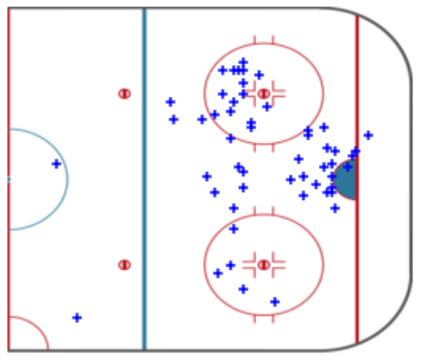

```{r setup, include=FALSE}
options(htmltools.dir.version = FALSE)
knitr::opts_chunk$set(echo = FALSE, eval = TRUE,
                      warning = FALSE, message = FALSE,
                      dev = 'png', dpi = 300)
```

```{r xaringan-themer, include=FALSE, warning=FALSE}
library(xaringanthemer)
style_duo_accent(
    primary_color   = "#035AA6",
    secondary_color = "#03A696",
    header_color    = "#000E2F",
    text_color      = "#000E2F",
    base_font_size  = "23px",
    ## code_inline_color = colorspace::lighten(gray),
    ## text_bold_color = colorspace::lighten(gray),
    link_color = "#E4002B",
    header_font_google = google_font("Proxima Nova"),
    text_font_google   = google_font("Helvetica"),
    code_font_google   = google_font("Fira Mono")
)
```

## Today's Workshop

- Introduction
- Data Fetching
  - `requests`
- Data Manipulating
  - `numpy`, `pandas`
- Data Visualizations
  - `matplotlib`


---

## Introduction

We will explore tools in Python that will allow us to explore hockey data

<br/>

Goal: Visualize where on the field skaters took shots and scored

<br/>

--

... but to do anything, we need a data source

---

## Data Sources

[Big Data Cup](https://github.com/bigdatacup/Big-Data-Cup-2021)

[Kaggle](https://www.kaggle.com/datasets/martinellis/nhl-game-data)

<br/>

**Specialty sources**

[Their Hockey Counts](https://theirhockeycounts.com/index.html#about)

[CHL microstats](https://www.patreon.com/user/overview?u=13951676)

[NHL microstats](https://www.patreon.com/CSznajder)

<br/>
--

But today we will be gathering data straight from the source - [NHL API](https://gitlab.com/dword4/nhlapi)

---

class: middle, center

## NHL API

```{r, out.width = "800px"}

```

---

## NHL API

```python
http://statsapi.web.nhl.com/api/v1/game/2021020002/feed/live
```

**Three Parts the the Game ID***
- Year: 2021
- Season: 02
- Game Number: 0002

---

## NHL API

```python

import requests

year = '2021'
season_type = '02' 
max_game_ID = 2000
```


---

## NHL API

```python
def get_game(i):
    game_ID = year + season_type +str(i).zfill(4)
    try:
        r = requests.get(url='http://statsapi.web.nhl.com/api/v1/game/'+ game_ID +'/feed/live',
                         timeout=5)
        data = r.json()
        return data
    except:
        pass
```

---

## Speeding it up with `multiprocessing`

```python
import multiprocessing

with multiprocessing.Pool(20) as pool:
        game_Data = pool.map(get_game, range(1,max_game_ID))

```

---

class: middle, center

## Extracting Data from the request

```{r, out.width = "700px"}

```

---

## Extracting Data from the request

```python
# event, x, y, team_o (offence team), team_d (defending team), period, player_o, year, month, time_in_period, date_time

master_data = []

for data in game_data:
    teams = {
        "away": data['gameData']['teams']['away']['name'],
        "home": data['gameData']['teams']['home']['name']
    }
    teams_list = list(teams.values())
    plays = data['liveData']['plays']['allPlays']
    
    # Year and month of game
    date = data['gameData']['datetime']['dateTime'].split('-')
    year = date[0]
    month = date[1]
    
```

---

## Extracting Data from the request

We care of two event types- `Shot` and `Goal`

```python
    for play in plays:
        for event in event_types:
            
            if play['result']['event'] in [event]:
                if 'x' in play['coordinates'] and 'y' in play['coordinates']:
                    x = play['coordinates']['x']
                    y = play['coordinates']['y']
                
                TEAM = play['team']['name']
                if TEAM:
                    team_o = TEAM
                    team_d = teams_list[(teams_list.index(TEAM) + 1) % 2]
                
                # period
                period = play['about']['period']
                
                master_data.append([event, x, y, team_o, team_d, period, player_o, year, month])
```

---

class: middle, center

```{r, out.width = "900px"}

```


---

## Data Manipulation

Once you have all the data, you can convert it into a `pandas` DataFrame for easier analysis

```python
df = pd.DataFrame(master_data, columns=['event', 'x', 'y', 'team_o', 'team_d', 'period', 'player_o', 'year', 'month', 'time', 'datetime'])
```

---

class: middle, center

## Resulting DataFrame

```{r, out.width = "800px"}

```

---

## Now the Fun part!

Now that we have all the data in the form we want, we can now start playing with the data!

--

Lets say I want to rank skaters with the highest scoring average ... What should I do?

---

class: middle, center

## Scoring Average Rank for Skaters

```{r, out.width = "800px"}

```

---

class: middle, center

## Scoring Average Rank for Skaters

```{r, out.width = "400px"}

```

--

Now say I want to do the same ... but with teams this time

---

class: middle, center

## Scoring Average Rank for Teams

```{r, out.width = "800px"}

```

---

class: middle, center

## Scoring Average Rank for Teams

```{r, out.width = "400px"}

```

--

But this does not give us as much information as we want ... we can do better!

---

class: middle, center

## Display of Goals and Shots for Teams

```{r, out.width = "800px"}

```

---

class: middle, center

## Display of Goals and Shots for Teams

```{r, out.width = "400px"}

```

---

class: middle, center

## Display of Goals and Shots for Teams (Improved)

```{r, out.width = "400px"}

```

---

class: middle, center


```{r, out.width = "1000px"}

```


---

## Visualizing Goals

Lets say I want to see where all the Goals scored on Tampa Bay Lightning were shot from, I can do a quick pandas filter and get all the data I need


```python
coors = df[ (df['team_d'] == 'Tampa Bay Lightning') & (df['event'] == 'Goal') ][['x', 'y']]
```

---

class: middle, center

## The Coordinates where the opposing team scored a goal on Tampa Bay Lightning

```{r}

```

---

class: middle, center

## A note about the Coordinates!

X: -100 to 100

Y: -42.5 to 42.5

```{r, out.width = "600px"}
knitr::include_graphics("images/Hockey-field.png")
```

---

class: middle, center

## Simple Visualization - Code

```{r, out.width = "800px"}

```

---

class: middle, center

## Simple Visualization - Graph

```{r, out.width = "500px"}

```

---

## Improved Visualization - Code

Place a picture of the field underneath the scatter plot

--

```python
from PIL import Image, ImageOps

image_file = "Hockey-field-half.png"
image = Image.open(image_file).resize((400,340))
image_arr = np.array(image.getdata())
image_arr = image_arr.reshape(image.size[1], image.size[0], 4)
```

---

class: middle, center

## Improved Visualization - Code

```{r, out.width = "800px"}

```

---


class: middle, center

## Improved Visualization - Graph

```{r, out.width = "400px"}

```

---


class: middle, center

## Improved Visualization - Graph

```{r, out.width = "400px"}

```


---


class: middle, center

## Visualization - Skaters

Visualizing where Alex Overchkin takes his shots.

```{r, out.width = "400px"}

```


---


class: middle, center

## Visualization - Skaters

Visualizing where Alex Overchkin scores.

```{r, out.width = "400px"}

```


---


class: middle, center

# Thank you!


